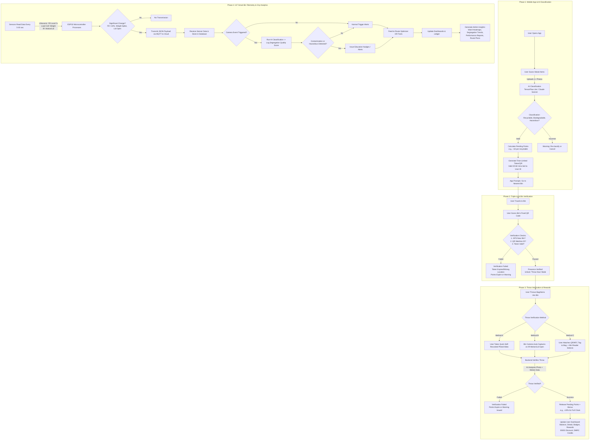

# Nayi Disha (WasteLoop) - System Architecture & Process Report

## 1. Executive Summary
Nayi Disha (WasteLoop) is an AI and IoT-powered municipal waste management platform designed to close the urban waste loop through verified citizen action and data-driven infrastructure. The system aims to solve the critical issues of low source segregation (currently stagnant at 50-60%) and inefficient, static logistics routes. 

By leveraging a mobile-first application, the platform incentivizes citizens for correct waste disposal using a triple-lock verification system (GPS + QR + Photo). Simultaneously, it utilizes retrofitted smart bins equipped with edge sensors to feed real-time fill-level data into a backend Route Optimizer (like OR-Tools), dynamically adjusting collection routes to save fuel and reduce carbon emissions.

---

## 2. System Architecture & Process Diagram
The following Mermaid diagram integrates the workflow and mindmap elements into a comprehensive architecture flow, making it easily understandable for AI analysis and developer reference.

---

## 3. Detailed Process Flow Description

### 3.1 Initial Waste Scanning and Pre-Classification
*   **Action:** The user initiates the process by opening the Nayi Disha app and taking single or multiple photographs of their sorted waste.
*   **AI Engine:** The images are processed on-device or via API (utilizing TensorFlow Lite / Claude Sonnet 4 Vision). 
*   **Categorization:** The AI classifies the waste into specific streams: Recyclable, Biodegradable, or Hazardous. If the classification fails, the user is warned to re-classify.
*   **Token Generation:** Based on the classified items, the backend calculates pending points (e.g., +10 points per recyclable). It then generates a time-limited, session-bound Token/QR code (valid for 30-60 minutes) tied to the specific User ID. 
*   **Prompt:** The app directs the user to the nearest smart bin to complete the physical disposal.

### 3.2 Geolocation and Bin Presence Verification (Anti-Gaming)
*   **Action:** The user travels to the physical bin and scans a permanent, fixed QR code printed on the bin.
*   **Validation Logic:** The system executes a rigorous check:
    1.  Is the user's GPS proximity matching the known coordinates of the bin?
    2.  Does the scanned QR code match the registered Bin ID?
    3.  Is the user's previously generated session token still valid and unexpired?
*   **Outcome:** If any condition fails, pending points expire. If verified, the app unlocks the **'Throw Now'** mode.

### 3.3 Throw Verification Mechanism
To ensure the waste was physically deposited (and not just carried to the bin), the system supports three branching verification methods:
1.  **User-Driven (App):** The user takes a quick photo or self-recorded video of the bag entering the bin.
2.  **Hardware-Driven (Bin):** An embedded IR sensor detects motion/lid-opening, triggering the bin's internal camera to auto-capture the throw event.
3.  **Tag-Driven (Physical):** The user attaches an NFC or QR tag to the bag, which is read by an internal bin scanner upon entry.
*   **Backend Resolution:** The backend analyzes the ingested proof (AI analyzing the photo/video, confirming motion detection). 

### 3.4 Reward Release and Dashboard Updates
*   Once the backend verifies the physical throw, pending points are officially released into the user's wallet.
*   Users receive bonuses (e.g., +20% for completing the full verification chain).
*   The User Dashboard updates to reflect the new WasteCoin balance, streaks, and badges. These points can be redeemed for real-world utilities, such as BSES electricity discounts or DMRC transit credits.

---

## 4. IoT Sensor Integration and Cloud Telemetry

### 4.1 Smart Bin Hardware Layer
The municipal bins are retrofitted with an ESP32 microcontroller suite that reads environmental data every 5 to 30 seconds:
*   **Ultrasonic Sensor:** Measures the distance to the waste surface to calculate Fill Level (%).
*   **Load Cell Sensor:** Measures total weight, helping detect heavy anomalies or construction debris.
*   **IR Sensor:** Detects physical motion or lid-open events, primarily used to trigger the camera module.
*   **Camera Module:** Captures internal photos if the bin is >80% full or if a lid event occurs.

### 4.2 Telemetry and Data Transmission
To conserve power and bandwidth, the microcontroller prepares a JSON payload but only transmits data to the cloud via **MQTT** if a "Significant Change" is detected (e.g., Fill level changes by >10%, a sudden weight spike occurs, or the lid is opened). 

---

## 5. Backend Processing, Analytics & Route Optimization

### 5.1 AI Contamination Checks
When the cloud receives the MQTT payload, it stores the data in the central database. If a photo was captured during the event, a secondary AI Classification is run on the bin's contents to generate a **Segregation Quality Score**. If hazardous materials or contamination are detected, the system branches off to trigger user education nudges or municipal alerts.

### 5.2 Dynamic Route Optimization
Normal trigger alerts (bin fill levels, weights) are fed directly into a Route Optimizer (utilizing OR-Tools for Solving the Travelling Salesperson Problem). Instead of relying on static, fixed weekly schedules, the algorithm generates optimized, dynamic routes for collection vehicles based on which bins actually need emptying.

### 5.3 Municipal Command Center
The system culminates in a live admin dashboard that provides authorities with:
*   Real-time Ward Heatmaps.
*   Segregation and Contamination Trends.
*   Performance and Compliance Reports.
*   Aggregated, anonymized insights into citizen disposal patterns, triggering targeted public awareness campaigns based on hard data.
